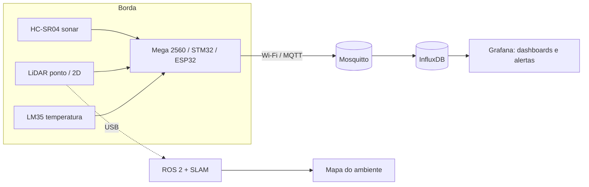

# lidar-sonar-lab

Laboratório de **mapeamento e monitoramento de ambientes com sonar e LiDAR**,
unindo eletrônica embarcada (Arduino Mega 2560, STM32 e ESP32) com práticas de
**Observabilidade e DevOps** (MQTT, séries temporais, Grafana, alertas, CI, etc).

> Status: 🟢 Lab 01 em andamento

[](https://github.com/itamarsb/lidar-sonar-lab/actions/workflows/ci.yml)

## Por que este projeto

Sensores de distância são a base de robótica, drones e aviônica
(altímetros, anticolisão ou mapeamento). Aqui cada sensor é tratado como uma
**fonte de telemetria**: os dados são medidos, validados em bancada
(osciloscópio e multímetro), analisados estatisticamente e, nas fases seguintes,
enviados a um pipeline de monitoramento com dashboards e alertas.

## Arquitetura alvo



## Roadmap

| Lab | Tema | Hardware | Status |
|:---:|---|:---:|:---:|
| [01](labs/lab01-sonar-basico/) | Sonar + compensação de temperatura + validação no osciloscópio | Mega 2560, HC-SR04, LM35 | 🟢 em andamento |
| 02 | Sonar com *timer input capture*: `pulseIn()` × Timer4 do Mega × STM32 | Mega 2560, NUCLEO-F303RE | ⚪ planejado |
| 03 | Radar de varredura com servo + telemetria MQTT → InfluxDB → Grafana | ESP32, servo | ⚪ planejado |
| 04 | LiDAR de ponto (TF-Luna/VL53L1X) em servo — comparação sonar × LiDAR | ESP32, servo | ⚪ planejado |
| 05 | LiDAR 2D com ROS 2 e SLAM; rover controlado por rádio RC | LD19/RPLIDAR, rádio, servos | ⚪ planejado |
| 06 | Detecção de mudanças no ambiente como eventos de observabilidade | todos | ⚪ planejado |

## Estrutura

```
labs/      um diretório por lab: firmware, roteiro e resultados.
tools/     scripts Python (coleta serial e análise).
infra/     docker compose (Mosquitto, InfluxDB e Grafana) — a partir do Lab 03.
docs/      imagens, diagramas e decisões de projeto.
.github/   CI: compilação do firmware e lint dos scripts.
```

## Bancada

Arduino Mega 2560 · ESP32 · STM32 NUCLEO-F303RE · osciloscópio USB 6022BL ·
multímetro VC9808 · kits MyLab UNINTER · servos e rádio de aeromodelismo.

## Autor

**Itamar de Sá Britto Júnior** — Engenharia de Computação (UNINTER) · Cloud / DevOps / SRE
[LinkedIn](https://www.linkedin.com/in/itamar-de-sa-britto-jr/) · [GitHub](https://github.com/itamarsb)

## Licença

MIT


---


## 📈 Repository Metrics


<p align="center">


<a href="https://info.flagcounter.com/Y91w"></a>

</p>
